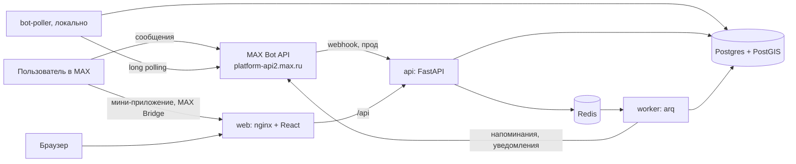

# Афиша рядом

Чат-бот и мини-приложение в MAX, где жители малых городов и сёл находят, куда сходить рядом с домом. Анонсы
концертов, кружков, праздников и киносеансов в маленьком населённом пункте разбросаны по объявлениям и чатам,
их легко пропустить. «Афиша рядом» собирает события в одну ленту по населённому пункту и радиусу. Событие можно
отметить «Пойду» и получить напоминание в MAX. Организатор (дом культуры, библиотека, музей или просто житель)
добавляет событие по шагам, администратор проверяет его перед публикацией.

| | |
|---|---|
| Бот в MAX | <https://max.ru/t805_hakaton_max_bot> |
| Сайт и мини-приложение | <https://vse-vezde.ru> |
| API | `https://vse-vezde.ru/api/v1` (base URL, например <https://vse-vezde.ru/api/v1/events>) |
| Репозиторий | <https://github.com/MaxHackathonTeam/Max_Bot> |
| Сдаваемая версия | commit hash указан на служебном слайде презентации |

## Оглавление

1. [Быстрая проверка за 5 минут](#1-быстрая-проверка-за-5-минут)
2. [Основной пользовательский сценарий](#2-основной-пользовательский-сценарий)
3. [Состав и архитектура](#3-состав-и-архитектура)
4. [Запуск одной командой через Docker](#4-запуск-одной-командой-через-docker)
5. [Параметры окружения](#5-параметры-окружения)
6. [Переменные окружения](#6-переменные-окружения)
7. [Порты](#7-порты)
8. [Зависимости](#8-зависимости)
9. [Внешние сервисы и интеграции](#9-внешние-сервисы-и-интеграции)
10. [Работа с данными](#10-работа-с-данными)
11. [Тестовые данные](#11-тестовые-данные)
12. [Пошаговый сценарий проверки](#12-пошаговый-сценарий-проверки)
13. [Примеры ожидаемого поведения](#13-примеры-ожидаемого-поведения)
14. [Возможности MAX сверх минимума](#14-возможности-max-сверх-минимума)
15. [Известные ограничения](#15-известные-ограничения)
16. [Остановка и повторный запуск](#16-остановка-и-повторный-запуск)
17. [Разработка и тесты](#17-разработка-и-тесты)
18. [Прод-деплой](#18-прод-деплой)
19. [Лицензии и атрибуция данных](#19-лицензии-и-атрибуция-данных)

## 1. Быстрая проверка за 5 минут

Работает в мобильном и веб-клиенте MAX.

1. Открой бота <https://max.ru/t805_hakaton_max_bot> и нажми «Начать» (или отправь `/start`). Бот поздоровается и
   попросит согласие с условиями. Нажми «✅ Принимаю».
2. Напиши название населённого пункта, например `Елабуга`, и выбери вариант из списка. Можно нажать
   «📍 Отправить геопозицию». Затем отметь интересы и нажми «Готово».
3. В меню нажми «🌐 Открыть приложение». Откроется мини-приложение с лентой событий рядом.
4. Открой любое событие и нажми «Пойду». Событие появится во вкладке «Пойду».
5. Бот пришлёт напоминание «Напоминание: «…» через 24 ч.» и ещё одно за 2 часа до начала. Проще всего
   проверить на событии, которое начинается сегодня или завтра.
6. Поиск в чате: напиши боту `концерт в субботу бесплатно`. Бот ответит «Понял так: суббота · бесплатно ·
   Концерты» и покажет подборку.

Все события в демо-наборе вымышленные и помечены плашкой «Демо-данные» ([раздел 11](#11-тестовые-данные)).

**Тестовые учётные записи жюри.** Вход по логину и паролю работает только через API ([раздел 12в](#в-api)).

| Роль | Логин | Пароль |
|---|---|---|
| Пользователь (`user`) | `jury_resident` | на служебном слайде |
| Проверенный организатор (`org_owner_verified`) | `jury_museum` | на служебном слайде |
| Непроверенный организатор (`org_owner_unverified`) | `jury_organizer` | на служебном слайде |
| Администратор (`admin`) | `jury_admin` | на служебном слайде |

Вход: `POST https://vse-vezde.ru/api/v1/auth/review-login` с телом `{"login":"…","password":"…"}`, в ответе
`access_token` для заголовка `Authorization: Bearer …`. Токен действует 12 часов. Перед действиями («Пойду»,
черновик, событие) прими условия: `POST /api/v1/me/consents` с `{"docs":["terms","privacy"]}`. Пароли в
репозиторий не попадают.

В MAX права администратора выдаются по ID аккаунта MAX. Чтобы проверить модерацию прямо в MAX, отправь боту
`/whoami` и передай свой ID команде: ⟨ЗАПОЛНИТЬ: контакт команды⟩.

## 2. Основной пользовательский сценарий

### Житель

| Шаг | Где | Что происходит |
|---|---|---|
| Знакомство | чат | `/start` → согласие с условиями → населённый пункт (текстом или геопозицией) → интересы |
| Поиск | чат | Кнопки «Сегодня», «Выходные», «💳 По Пушкинской», «Для детей», «Бесплатно» или свободный запрос вроде «кино завтра вечером» |
| Лента | мини-приложение | Вкладки «Официальные» и «От сообщества». Фильтры: радиус 5/15/30/50 км, дата, категория, цена, Пушкинская карта, возраст |
| Карточка | мини-приложение | Описание, сеансы, площадка, цена, кнопки «Пойду» и «Поделиться» |
| Напоминание | чат | За 24 и за 2 часа до сеанса, с кнопкой, которая открывает карточку |
| Настройки | чат и мини-приложение | Радиус, интересы, напоминания и дайджест, удаление своих данных (`/delete_me`) |

### Организатор и администратор

1. **Создание.** Организатор нажимает «➕ Добавить афишу» в боте (`/add`) или «Добавить» в мини-приложении.
   Мастер ведёт по шагам: название → дата и время → место → площадка → категория → цена → описание → обложка →
   предпросмотр. Дату и цену можно писать обычным текстом («в субботу в 18:00», «300 руб.»), их разбирают
   детерминированные правила.
2. **Автопроверка.** Перед отправкой правила проверяют обязательные поля, даты, ссылки (сокращатели и опасные
   домены запрещены) и стоп-слова.
3. **Модерация.** Событие получает статус «на модерации». Администратору приходит сообщение в бот с кнопками
   «Одобрить» и «Отклонить». Полная очередь с деталями — в мини-приложении, в разделе «Модерация».
4. **Публикация.** После одобрения событие попадает в ленту, автору приходит «✅ Событие «…» опубликовано.».
   События проверенной организации идут в ленту «Официальные». События жителя или непроверенной
   организации идут в «От сообщества».
5. **Управление.** Организатор видит свои события и их статусы в `/my` или в разделе «Мои афиши». Событие
   можно изменить, отменить или удалить. При отмене все, кто отметил «Пойду», получают сообщение в бот.

**Что в чате, а что в мини-приложении.** В чате — быстрые действия: онбординг, подборки, поиск фразой, мастер
добавления, напоминания и кнопки модерации. В мини-приложении — всё, что неудобно делать перепиской: лента с
фильтрами, карточки, «Пойду», кабинет организации и очередь модерации. Мини-приложение открывается кнопкой из
бота или по диплинку.

## 3. Состав и архитектура

| Сервис compose | Образ | Роль |
|---|---|---|
| `db` | `postgis/postgis:16-3.4` | PostgreSQL 16 + PostGIS + pg_trgm, все данные |
| `redis` | `redis:7-alpine` | Очередь фоновых задач, шаги диалогов бота, коды входа, ограничение частоты запросов |
| `migrate` | `afisha-backend:local` | Запускается один раз: миграции Alembic → роль приложения в БД → справочник населённых пунктов и демо-данные. Завершается с кодом 0 |
| `api` | `afisha-backend:local` | FastAPI: REST API `/api/v1`, webhook бота `/bot/webhook`, `/health`, `/ready` |
| `worker` | `afisha-backend:local` | arq: напоминания, дайджест, доставка уведомлений, проверка webhook |
| `bot-poller` | `afisha-backend:local` | Бот в режиме long polling для локального запуска (профиль `local`) |
| `web` | `afisha-web:local` | nginx со сборкой React: сайт и мини-приложение, проксирует `/api` в `api` |
| `caddy` | `caddy:2-alpine` | Только в проде: HTTPS (Let's Encrypt) и маршрутизация на `api` и `web` |



В проде перед `api` и `web` стоит Caddy, наружу открыты только порты 80 и 443.

**Где что лежит**

| Путь | Содержимое |
|---|---|
| `backend/app/services/` | Бизнес-логика и проверка прав. Роутеры в `backend/app/api/` тонкие |
| `backend/app/bot/` | Бот: обработка сообщений, мастер «Добавить афишу», клавиатуры, все тексты (`texts.py`) |
| `backend/app/parsing/` | Разбор поисковой фразы, дат и цен детерминированными правилами |
| `backend/app/moderation/` | Правила автопроверки событий |
| `backend/app/workers/` | Фоновые задачи arq |
| `backend/app/demo/`, `data/seed/` | Генератор демо-событий и справочники |
| `backend/migrations/` | Миграции Alembic |
| `frontend/src/` | Мини-приложение и сайт: React 18 + TypeScript + Vite |
| `infra/caddy/Caddyfile` | Конфигурация Caddy для прода |

## 4. Запуск одной командой через Docker

Нужны Docker и Docker Compose **v2.24 или новее**: compose-файлы используют `env_file.required` и `!reset`.

```bash
git clone https://github.com/MaxHackathonTeam/Max_Bot.git Max_Bot && cd Max_Bot
cp .env.example .env
docker compose --profile local up --build
```

Эта команда поднимает все локальные компоненты. `make up` делает то же самое.

Всё запускается **без токена MAX и без правки `.env`**. Примерно через полторы минуты:

- сайт — <http://localhost:8080>;
- API — <http://localhost:8000/api/v1/events>, проверка готовности — <http://localhost:8000/ready>;
- в логах `migrate` появится `seed_loaded`, и контейнер завершится с кодом 0. Так и должно быть.

Без токена `bot-poller` просто ждёт, в логе будет `MAX_BOT_TOKEN не задан — бот не запущен`. Если запустить без
`--profile local` (`docker compose up --build`), поднимется всё, кроме бота.

**Как включить бота локально**

1. Создай **отдельного тестового бота** на платформе MAX для партнёров и возьми его токен. Токен боевого бота
   брать нельзя: локальный poller и прод будут отбирать друг у друга обновления.
2. Впиши в `.env` строки `MAX_BOT_TOKEN=<токен>` и `MAX_BOT_USERNAME=<ник_бота>`.
3. Перезапусти: `docker compose --profile local up --build`. Бот начнёт отвечать в MAX.

Кнопка «Открыть приложение» открывает адрес мини-приложения из настроек бота на платформе MAX. Этот адрес должен
быть публичным HTTPS, `localhost` не подойдёт ([раздел 9](#9-внешние-сервисы-и-интеграции)).

## 5. Параметры окружения

| Параметр | Значение |
|---|---|
| ОС | Любая с Docker: Linux, macOS, Windows (WSL 2) |
| Docker Compose | v2.24+ |
| Свободные порты | 8000 и 8080 на `127.0.0.1` |
| Память | Около 400 МБ на весь стек в простое (замер: БД около 200 МБ, api около 90 МБ, worker около 85 МБ). Рекомендуем выделить Docker не меньше 2 ГБ |
| Диск | Около 1,6 ГБ образов (postgis 850 МБ, backend 545 МБ, web 77 МБ, redis 59 МБ) и около 460 МБ БД со справочником. Рекомендуем 3 ГБ свободного места |
| Сеть | Нужна при первой сборке, чтобы скачать образы и зависимости |

**Время сборки** (замер на Apple Silicon, у Docker 8 ГБ памяти):

- `docker compose build --no-cache` при уже скачанных базовых образах — **21 с**. Лимит ТЗ — 5 минут, без
  учёта загрузки базовых образов.
- Полностью холодная сборка, включая загрузку базовых образов и всех зависимостей, — **50 с**.
- Первый запуск `up` до готовности всех сервисов занимает ещё около 45 с: загружаются справочник населённых
  пунктов и демо-набор.

## 6. Переменные окружения

Переменные берутся из `.env`, шаблон — [`.env.example`](.env.example). Пустое значение (`KEY=`) означает
«взять значение по умолчанию». **Для локального запуска ничего менять не нужно.**

| Переменная | Нужна локально | Нужна в проде | По умолчанию | Пример | Что делает | Где взять |
|---|---|---|---|---|---|---|
| `ENV` | нет | да, `prod` | `local` | `prod` | Режим. При `prod` включаются проверки, описанные ниже | — |
| `PUBLIC_BASE_URL` | нет | да | `http://localhost:8080` | `https://afisha.example.ru` | Публичный адрес сайта. Из него собирается адрес webhook `…/bot/webhook` | Ваш домен |
| `CORS_ORIGINS` | нет | нет | = `PUBLIC_BASE_URL` | `https://a.ru,https://b.ru` | С каких адресов разрешены запросы к API | — |
| `DOMAIN` | нет | да | — | `afisha.example.ru` | Домен для Caddy и сертификата, без `https://` | Ваш домен |
| `POSTGRES_PASSWORD` 🔒 | нет | да | `afisha` | — | Пароль владельца БД | Сгенерируй: `openssl rand -hex 24` |
| `MAX_BOT_TOKEN` 🔒 | нет* | да | — | — | Токен бота MAX. Без него не работают бот, вход через MAX и уведомления | Значение — на первом слайде презентации. Для своего бота — на платформе MAX для партнёров |
| `MAX_BOT_USERNAME` | нет* | да | — | `afisha_bot` | Ник бота. Нужен для диплинков `max.ru/<ник>?startapp=…` и входа на сайт кодом | `t805_hakaton_max_bot` |
| `MAX_API_BASE` | нет | нет | `https://platform-api2.max.ru` | — | Адрес MAX Bot API | — |
| `MAX_WEBHOOK_SECRET` 🔒 | нет | да | — | — | Секрет в заголовке webhook. API принимает обновления только с ним, то есть только от MAX | Сгенерируй: `openssl rand -hex 32` |
| `BOT_MODE` | нет | задан в compose | `polling` | `webhook` | Как бот получает обновления. `compose.prod.yaml` ставит `webhook` для `api` и `worker` | — |
| `BOT_POLLER_TAKEOVER` ⚠️ | нет | нет | выкл. | `1` | Разрешает локальному poller снять webhook-подписку бота. **Опасно с боевым токеном**: прод-бот перестанет отвечать. Без `1` poller webhook не трогает и только пишет ошибку в лог | Не включать без необходимости |
| `DATABASE_URL` 🔒 | нет | да | `postgresql+asyncpg://afisha_app:afisha_app@db:5432/afisha` | `postgresql+asyncpg://afisha_app:<APP_DB_PASSWORD>@db:5432/afisha` | Подключение приложения под ролью `afisha_app`, у которой нет прав менять схему БД | Собери из `APP_DB_PASSWORD` |
| `MIGRATE_DATABASE_URL` 🔒 | нет | да | `postgresql+asyncpg://afisha:afisha@db:5432/afisha` | `postgresql+asyncpg://afisha:<POSTGRES_PASSWORD>@db:5432/afisha` | Подключение владельца БД, только для миграций | Собери из `POSTGRES_PASSWORD` |
| `APP_DB_PASSWORD` 🔒 | нет | да | `afisha_app` | — | Пароль роли `afisha_app`, задаётся при миграции | Сгенерируй: `openssl rand -hex 24` |
| `REDIS_URL` | нет | нет | `redis://redis:6379/0` | — | Подключение к Redis | — |
| `JWT_SECRET` 🔒 | нет | да | случайный при каждом старте | — | Подпись токенов входа. Если не задан, локально входы сбрасываются при перезапуске `api`, а в проде приложение не стартует | Сгенерируй: `openssl rand -hex 32` |
| `GUEST_JWT_TTL_DAYS` | нет | нет | `30` | `30` | Сколько дней действует гостевой вход на сайте | — |
| `ADMIN_MAX_USER_IDS` | нет | да | пусто | `42, 43` | ID администраторов в MAX через запятую. Свой ID бот показывает по `/whoami`. Администратор должен хотя бы раз нажать «Начать» у бота | Отправь боту `/whoami` |
| `SEED_DEMO` | нет | нет | `1` | `0` | Загружать ли демо-события при старте | — |
| `DEV_AUTH` ⚠️ | нет | запрещён | `0` | `1` | **Только для локальной проверки.** Вход на сайт без MAX по ссылке с `?dev_user=<id>`, подпись не проверяется. При `ENV=prod` с `DEV_AUTH=1` приложение не запустится, а `compose.prod.yaml` всё равно ставит `0` | — |
| `REVIEW_MODE` ⚠️ | нет | по решению | `0` | `1` | Включает `POST /api/v1/auth/review-login` — вход тестовых учёток жюри. Если выключен, эндпоинт отвечает 404 | — |
| `REVIEW_ACCOUNTS` 🔒 | нет | при `REVIEW_MODE=1` | пусто | `[{"login":"jury_user","password":"<пароль>","role":"user"}]` | Учётки жюри в формате JSON. Роли: `user`, `org_owner_verified`, `org_owner_unverified`, `admin` | Логины и пароли — в [разделе 1](#1-быстрая-проверка-за-5-минут) |
| `LOG_LEVEL` | нет | нет | `INFO` | `DEBUG` | Уровень подробности логов | — |
| `MEDIA_DIR` | нет | нет | `/app/media` | — | Каталог обложек внутри контейнера (volume `media-data`) | — |

🔒 — секрет, его значения нет ни в репозитории, ни в README. ⚠️ — опасный переключатель.
\* Нужен, чтобы проверить бота локально ([раздел 4](#4-запуск-одной-командой-через-docker)).

## 7. Порты

| Сервис | Порт на хосте | Порт в контейнере | Доступен снаружи? |
|---|---|---|---|
| `web` (сайт, мини-приложение) | `127.0.0.1:8080` | 80 | Локально — только с этой машины. В проде — через Caddy |
| `api` | `127.0.0.1:8000` | 8000 | Локально — только с этой машины. В проде — через Caddy (`/api`, `/bot`, `/health`, `/ready`) |
| `caddy` (только прод) | 80, 443 (TCP и UDP) | 80, 443 | Да, это единственная точка входа |
| `db` | — | 5432 | Нет, только внутри сети compose |
| `redis` | — | 6379 | Нет, только внутри сети compose |

## 8. Зависимости

| Что | Версия | Где зафиксировано |
|---|---|---|
| Python | 3.12 | `backend/pyproject.toml`, образы `python:3.12-slim-bookworm` и `ghcr.io/astral-sh/uv:0.9.30-python3.12-bookworm-slim` |
| Библиотеки бэкенда | FastAPI, Pydantic v2, SQLAlchemy 2 (async) + asyncpg, Alembic, GeoAlchemy2, arq, redis, httpx, structlog, PyJWT, Pillow, timezonefinder, snowballstemmer | точные версии — в [`backend/uv.lock`](backend/uv.lock) |
| Node.js | 22 | образ `node:22-alpine`, только для сборки |
| Библиотеки фронтенда | React 18.3, React Router 6, TanStack Query 5, Vite 6, TypeScript 5.8, Vitest | точные версии — в [`frontend/package-lock.json`](frontend/package-lock.json) |
| Веб-сервер | nginx 1.27 | образ `nginx:1.27-alpine` |
| БД | PostgreSQL 16 + PostGIS 3.4 | образ `postgis/postgis:16-3.4` |
| Redis | 7 | образ `redis:7-alpine` |
| Прокси (прод) | Caddy 2 | образ `caddy:2-alpine` |

Dockerfile: [`backend/Dockerfile`](backend/Dockerfile) и [`frontend/Dockerfile`](frontend/Dockerfile). Зависимости
ставятся строго по lock-файлам (`uv sync --frozen`, `npm ci`).

## 9. Внешние сервисы и интеграции

**Единственный внешний сервис — MAX.**

| Интеграция | Как используется |
|---|---|
| MAX Bot API (`https://platform-api2.max.ru`, заголовок `Authorization: <токен>`) | Сообщения и кнопки бота, меню команд, подписка на webhook, получение обновлений через polling при локальном запуске |
| Webhook | MAX присылает обновления на `https://<домен>/bot/webhook` вместе с секретом `MAX_WEBHOOK_SECRET`. Worker раз в 5 минут проверяет подписку и при необходимости восстанавливает её |
| Мини-приложение | Открывается из бота. Скрипт MAX Bridge (`https://st.max.ru/js/max-web-app.js`) передаёт подписанные данные пользователя (`initData`), API проверяет подпись |
| Вход на сайт через MAX | Сайт выдаёт одноразовый код, он живёт 5 минут. Пользователь подтверждает вход в боте по ссылке `https://max.ru/<бот>?start=login_<код>` |

**Что нельзя воспроизвести в Docker.** Сам мессенджер MAX и публичный HTTPS-адрес: MAX доставляет webhook и
открывает мини-приложение только по публичному HTTPS. Поэтому основной сценарий в MAX проверяется на развёрнутой
версии: <https://max.ru/t805_hakaton_max_bot>. Чтобы проверить бота локально, нужен токен отдельного тестового бота
([раздел 4](#4-запуск-одной-командой-через-docker)). Чтобы мини-приложение открывалось из MAX на локальной
машине, нужен HTTPS-туннель, и его адрес надо указать в настройках бота на платформе MAX.

| Без токена MAX работает | Без токена MAX не работает |
|---|---|
| Сайт: лента, фильтры, карточки, организации | Бот |
| API для чтения без входа: `/events`, `/localities`, `/categories`, `/search/parse` | Вход на сайт через MAX: `/auth/web-code` отвечает 503 `bot_unavailable` |
| Гостевой вход на сайте и «Пойду» | Уведомления и напоминания в бот |
| Создание события и модерация через API с тестовыми учётками или на сайте с `DEV_AUTH` | Мини-приложение внутри MAX |

**Не используются:** LLM, DaData, геокодеры, сторонние афиши и парсинг сайтов. Разбор поисковой фразы, дат и
цен, автомодерация и проверка ИНН (формат и контрольная сумма) работают на детерминированных правилах
(`backend/app/parsing/`, `backend/app/moderation/`).

## 10. Работа с данными

**Что хранится.** Всё лежит в PostgreSQL, volume `db-data`:

| Данные | Что это |
|---|---|
| Пользователи | ID в MAX, имя, населённый пункт, радиус, интересы, настройки уведомлений, принятые документы. У гостей сайта нет ID MAX |
| Населённые пункты и площадки | Справочник из OpenStreetMap и площадки с координатами |
| Организации | Название, ИНН, участники, статус проверки |
| События и сеансы | Описание, категория, цена, возраст, даты. Уровень доверия: `official`, `community` или `demo` |
| «Пойду» и подписки на организации | То, что сохранил пользователь |
| Модерация и жалобы | Решения администратора с причинами, жалобы пользователей |
| Уведомления | Очередь напоминаний и сообщений в бот |
| `audit_log` | Журнал изменений: кто, когда и что поменял в каждой сущности |

**Redis** (volume `redis-data`) хранит очередь фоновых задач, шаги диалога бота (24 часа), коды входа на сайт
(5 минут) и счётчики ограничения частоты запросов. **Обложки** — файлы WebP в volume `media-data`.

**Персональные данные.** Хранится минимум: ID и имя из MAX. Номер телефона не сохраняется, только отметка
«телефон подтверждён» при проверке организации. Удалить свои данные можно командой `/delete_me` в боте или в
настройках мини-приложения (`DELETE /api/v1/me`). Удаляются «Пойду», подписки, черновики и запланированные
уведомления, из профиля стираются имя и ID MAX. Остаются только отметки о согласии и авторство опубликованных
событий, уже без привязки к человеку.

**Журнал изменений.** Каждое изменение пользователей, событий и организаций, а также каждое решение модерации
записывается в `audit_log`. Приложение работает под ролью БД `afisha_app`: она может добавлять записи в журнал,
но не может менять или удалять их. Администратор видит журнал через `GET /api/v1/admin/audit`.

**Две ленты.** «Официальные» (события проверенных организаций) и «От сообщества» (события жителей и
непроверенных организаций) не смешиваются. В API это параметр `tier=official|community`, в интерфейсе — две
вкладки.

**Резервная копия** (стек должен быть запущен):

```bash
docker compose exec -T db pg_dump -U afisha -Fc afisha > afisha-$(date +%F).dump
```

## 11. Тестовые данные

> **События в демо-наборе вымышленные, а населённые пункты и площадки — реальные.**

- В демо-наборе около 436 событий на 4 недели вперёд от даты загрузки, 92 площадки и около 50 организаций. Они
  распределены по 31 населённому пункту в трёх регионах: Новгородская область (20 пунктов), Республика
  Татарстан (5, в том числе Елабуга и Свияжск) и Ярославская область (6).
- **Как помечены.** У демо-событий уровень доверия `demo` и источник `demo`. В интерфейсе у них плашка
  «Демо-данные», в боте — пометка «🧪 демо», в API — поле `"is_demo": true`.
- **Как загрузить.** Набор загружается сам при первом `up` (сервис `migrate`, `SEED_DEMO=1`). Перезагрузить
  вручную:

  ```bash
  make seed
  # то же без make:
  docker compose run --rm -e SEED_DEMO=1 migrate python -m app.seed
  ```

  Повторная загрузка ничего не дублирует. Генератор детерминирован (фиксированный seed), каждый запуск сдвигает
  сеансы к текущей дате.
- **Отключить демо-события** можно строкой `SEED_DEMO=0` в `.env`, её надо добавить до первого запуска.
- **Справочник населённых пунктов** `data/seed/localities_ru.csv.gz` — около 146 тыс. населённых пунктов России
  из OpenStreetMap (© участники OpenStreetMap, ODbL). Он загружается всегда, даже при `SEED_DEMO=0`.
  Демо-справочники лежат в `data/seed/localities.json`, `venues.json` и `cities.json`, генератор событий — в
  `backend/app/demo/`.

## 12. Пошаговый сценарий проверки

### а) В MAX — основной сценарий

Проверь в мобильном клиенте MAX и в веб-версии (web.max.ru).

| # | Действие | Ожидаемый результат |
|---|---|---|
| 1 | Открыть <https://max.ru/t805_hakaton_max_bot>, нажать «Начать» | Приветствие «Привет, …! 👋», затем просьба о согласии с кнопками «📄 Условия», «🔒 Политика», «✅ Принимаю» |
| 2 | Нажать «✅ Принимаю» | Вопрос о населённом пункте и кнопка «📍 Отправить геопозицию» |
| 3 | Написать `Елабуга` и выбрать вариант | «Запомнил: Елабуга 📍», затем выбор интересов |
| 4 | Отметить интересы, нажать «Готово» | Главное меню: «🔎 Найти события», «➕ Добавить афишу», «⭐ Пойду», «🌐 Открыть приложение» и другие кнопки |
| 5 | «🔎 Найти события» → «Выходные» | Подборка с заголовком «🏛 Официальные · …», у событий пометка «🧪 демо» |
| 6 | Написать `концерт в субботу бесплатно` | «Понял так: суббота · бесплатно · Концерты» и подборка (или «Ничего не нашёл — попробуй изменить запрос.») |
| 7 | Нажать «🌐 Открыть приложение» | Мини-приложение с лентой вокруг выбранного пункта, у событий плашки «Демо-данные» |
| 8 | Открыть событие, нажать «Пойду» | Кнопка меняет состояние, событие появляется во вкладке «Пойду». На телефоне — лёгкая вибрация |
| 9 | Нажать «Поделиться» в карточке | На телефоне открывается окно отправки в чат MAX. В веб-версии — «Ссылка скопирована — отправь её в чат» |
| 10 | Дождаться момента за 24 или за 2 часа до сеанса | Сообщение бота «Напоминание: «…» через 24 ч.» с кнопкой, открывающей карточку |
| 11 | Нажать «Назад» в шапке MAX внутри мини-приложения | Возврат на предыдущий экран, приложение не закрывается |
| 12 | Отправить `/abc` | «Такой команды нет. Список команд — /help, а вот меню 👇» |
| 13 | Отправить `/delete_me` и подтвердить | Данные удалены. Следующий `/start` начнёт онбординг заново |

**Роли в MAX**

| Роль | Как получить | Что проверить |
|---|---|---|
| Пользователь | Любой аккаунт MAX | Шаги 1–13 |
| Организатор | Нажать «➕ Добавить афишу» | Пройти мастер → «Отправить на проверку» → в `/my` статус «на модерации». После одобрения приходит «✅ Событие «…» опубликовано.», событие появляется в ленте «От сообщества» |
| Администратор | ID из `/whoami` должен быть в `ADMIN_MAX_USER_IDS` | `/whoami` отвечает «Ты модератор…». Новые заявки приходят в бот с кнопками «Одобрить» и «Отклонить». В мини-приложении: меню → «Модерация», очередь, карточка заявки, решение с причиной |

### б) Сайт в браузере (локально, без MAX)

| # | Действие | Ожидаемый результат |
|---|---|---|
| 1 | Открыть <http://localhost:8080> | Вопрос «Где ты живёшь?» и поле «Населённый пункт» |
| 2 | Ввести `Елабуга` и выбрать | Лента с плашками «Демо-данные» и вкладками «Официальные» и «От сообщества» |
| 3 | Поменять радиус, дату, категорию, включить «Бесплатно» или «Пушкинская карта» | Лента обновляется |
| 4 | Открыть событие и нажать «Пойду» | Сайт сам создаёт гостевой вход и просит принять условия («Принимаю»). После этого событие во вкладке «Пойду» |
| 5 | Нажать «Добавить» | Сайт объясняет, что для публикации нужен вход через MAX, и предлагает «Войти через MAX». Без токена бота вход недоступен — создай событие через API ([шаг в](#в-api)) |
| 6 | Проверить модерацию: в `.env` задать `DEV_AUTH=1` и `ADMIN_MAX_USER_IDS=100`, выполнить `docker compose --profile local up -d`, открыть <http://localhost:8080/moderation?dev_user=100> | Экран «Модерация» с очередью, в ней событие из блока (в). После одобрения событие появляется во вкладке «От сообщества» |

После проверки верни `DEV_AUTH=0`.

### в) API

Все эндпоинты описаны в [`openapi.yaml`](openapi.yaml), эндпоинты для проверки — в [`DATA-API.yaml`](DATA-API.yaml).
Swagger UI локально: <http://localhost:8000/docs>. Чтобы проверить прод, замени `http://localhost:8000` на
`https://vse-vezde.ru`.

```bash
B=http://localhost:8000/api/v1

# 1. Живость и готовность
curl -s http://localhost:8000/health          # {"status":"ok"}
curl -s http://localhost:8000/ready           # {"status":"ok","checks":{"db":"ok","redis":"ok"},...}

# 2. Населённый пункт и его лента
curl -s -G "$B/localities" --data-urlencode "q=Елабуга"   # [{"id":13903,"name":"Елабуга","kind":"town",...}, ...]
curl -s "$B/events?locality_id=13903&limit=2"             # {"items":[...],"next_cursor":"...","total":null}
curl -s "$B/events?locality_id=13903&tier=community"

# 3. Разбор поисковой фразы
curl -s -X POST $B/search/parse -H 'Content-Type: application/json' \
  -d '{"text":"концерт в субботу бесплатно"}'

# 4. Гость: согласие и «Пойду»
T=$(curl -s -X POST $B/auth/guest | python3 -c 'import json,sys;print(json.load(sys.stdin)["access_token"])')
curl -s -X POST $B/me/consents -H "Authorization: Bearer $T" -H 'Content-Type: application/json' \
  -d '{"docs":["terms","privacy"]}'
curl -s -X POST $B/events/182/save -H "Authorization: Bearer $T" -H 'Content-Type: application/json' -d '{}'
curl -s $B/me/saved -H "Authorization: Bearer $T"
```

**Роли через тестовые учётки.** Нужен `REVIEW_MODE=1`; на проде режим включён, логины — в [разделе 1](#1-быстрая-проверка-за-5-минут), пароли — на служебном слайде. Для
локальной проверки задай в `.env` `REVIEW_MODE=1` и `REVIEW_ACCOUNTS` со своими паролями, затем перезапусти стек.

```bash
login() { curl -s -X POST $B/auth/review-login -H 'Content-Type: application/json' \
  -d "{\"login\":\"$1\",\"password\":\"$2\"}" | python3 -c 'import json,sys;print(json.load(sys.stdin)["access_token"])'; }
ORG=$(login 'jury_museum' '<пароль со слайда>')
ADM=$(login 'jury_admin' '<пароль со слайда>')

# Организатор: согласие → черновик → проверка → отправка
curl -s -X POST $B/me/consents -H "Authorization: Bearer $ORG" -H 'Content-Type: application/json' -d '{"docs":["terms","privacy"]}'
curl -s -X POST $B/events -H "Authorization: Bearer $ORG" -H 'Content-Type: application/json' -d '{
  "title":"Концерт хора ветеранов","category":"concert","locality_id":13903,"price_type":"free","age_rating":0,
  "description":"Народные песни в сельском доме культуры, вход свободный для всех жителей.",
  "sessions":[{"starts_at":"2026-12-10T15:00:00+03:00"}]}'            # {"id":437,"status":"draft","trust_tier":"community",...}
N=437                                                                  # id из ответа выше
curl -s -X POST $B/events/$N/check  -H "Authorization: Bearer $ORG"   # {"violations":[],"warnings":[]}
curl -s -X POST $B/events/$N/submit -H "Authorization: Bearer $ORG"   # {"id":437,"status":"pending",...}

# Не администратор не видит очередь
curl -s $B/admin/queue -H "Authorization: Bearer $ORG"   # 403 {"error":{"code":"forbidden","message":"Раздел только для модераторов",...}}

# Администратор: очередь → одобрение → журнал
curl -s $B/admin/queue -H "Authorization: Bearer $ADM"   # {"events":[{"id":437,"status":"pending",...}],"verifications":[]}
curl -s -o /dev/null -w '%{http_code}\n' -X POST $B/admin/events/$N/decision -H "Authorization: Bearer $ADM" \
  -H 'Content-Type: application/json' -d '{"action":"approve"}'     # 204
curl -s "$B/events?locality_id=13903&tier=community"     # событие 437 в ленте «От сообщества»
curl -s "$B/admin/audit?limit=2" -H "Authorization: Bearer $ADM"
# {"items":[{"action":"event.moderation.admin","entity_id":437,"diff":{"status":["pending","published"],"verdict":"approve"},...},
#           {"action":"event.submit","diff":{"status":["draft","pending"],...},...}]}
```

Другие решения модерации: `reject`, `hide`, `return` (вернуть на доработку). Права меняет только роль `admin`.
Учётки `user`, `org_owner_verified` и `org_owner_unverified` ведут себя как обычный пользователь, который может
создавать события от своего имени.

## 13. Примеры ожидаемого поведения

Все ответы сняты с локального запуска.

**`GET /health`**

```json
{"status":"ok"}
```

**`GET /ready`**

```json
{"status":"ok","checks":{"db":"ok","redis":"ok"},"bot":{"mode":"polling"}}
```

**`GET /api/v1/events?locality_id=13903&limit=1`** (часть полей опущена)

```json
{
  "items": [
    {
      "id": 182,
      "title": "Выставка местных художников «Родные просторы»",
      "category": "exhibition",
      "trust_tier": "demo",
      "is_demo": true,
      "org": {"id": 36, "name": "Елабужский музей-заповедник", "verified": true},
      "venue": {"id": 56, "name": "Елабужский музей-заповедник", "address": "Елабуга, Старый город"},
      "locality": {"id": 13903, "name": "Елабуга"},
      "timezone": "Europe/Moscow",
      "next_session": {"id": 232, "starts_at": "2026-09-30T09:00:00Z", "status": "scheduled"},
      "distance_km": 0.3,
      "price_type": "free",
      "pushkin_card": false,
      "age_rating": 0
    }
  ],
  "next_cursor": "eyJzIjoiZGF0ZSIs…",
  "total": null
}
```

**Ошибки** всегда приходят в формате `{"error": {"code", "message", "details"}}`, сообщения — по-русски:

```text
GET  /api/v1/events?radius_km=7               → 400 {"error":{"code":"bad_request","message":"Радиус может быть 5, 15, 30 или 50 км","details":{}}}
GET  /api/v1/events/999999                    → 404 {"error":{"code":"event_not_found","message":"Событие не найдено","details":{}}}
POST /api/v1/events/182/save (без согласия)   → 403 {"error":{"code":"consent_required","message":"Чтобы сохранять события, прими условия и политику","details":{}}}
GET  /api/v1/admin/queue (не администратор)   → 403 {"error":{"code":"forbidden","message":"Раздел только для модераторов","details":{}}}
POST /api/v1/auth/review-login (неверный пароль) → 401 {"error":{"code":"invalid_credentials","message":"Неверный логин или пароль","details":{}}}
POST /api/v1/auth/web-code (нет токена MAX)   → 503 {"error":{"code":"bot_unavailable","message":"Вход через MAX сейчас недоступен","details":{}}}
POST /api/v1/events {"age_rating":"abc",…}    → 422 {"error":{"code":"validation_error","message":"Проверь введённые данные","details":{"fields":[{"loc":["body","age_rating"],"type":"literal_error","msg":"Input should be 0, 6, 12, 16 or 18"}]}}}
```

**Бот**

- На неизвестную команду `/abc` бот отвечает «Такой команды нет. Список команд — /help, а вот меню 👇» и
  показывает главное меню.
- На непонятный текст: «Не понял 🤔 Напиши, что ищешь — например, «концерт в субботу» или «для детей бесплатно»,
  или выбери в меню 👇».
- Если рядом нет событий, бот предлагает кнопку «Расширить до … км».

**Сетевая ошибка в мини-приложении.** Если запрос не прошёл, на месте блока появляется сообщение об ошибке и
кнопка «Повторить». Перезапускать приложение не нужно, остальные экраны продолжают работать.

## 14. Возможности MAX сверх минимума

| Возможность | Где увидеть |
|---|---|
| Диплинки `startapp` в мини-приложение: `ev_<id>` (карточка события), `org_<id>`, `draft_<id>`, `inv_<токен>` (приглашение в команду организации), `feed_<подборка>`, `mod_<id>` (модерация), `legal_<документ>` | Кнопки в сообщениях бота, «Поделиться» в карточке, напоминания |
| Геолокация: кнопка `request_geo_location` в чате, «Я здесь» на сайте | Шаг 2 онбординга, [сценарий 12а](#а-в-max--основной-сценарий) |
| Контакт: кнопка `request_contact` с проверкой подписи | Проверка организации: владелец подтверждает телефон, сам номер не хранится |
| Шеринг через `shareMaxContent` | «Поделиться» в карточке на телефоне. В веб-версии ссылка копируется |
| Кнопка «Назад» MAX (BackButton) | Шапка мини-приложения |
| Вибрация (haptic feedback) | «Пойду» и другие действия на телефоне |
| Кнопка `open_app` и меню команд бота | «🌐 Открыть приложение», меню «/» в чате |
| Уведомления от бота | Напоминания за 24 и за 2 часа, дайджест на выходные, статус модерации, отмена события, заявки администратору с кнопками решения |
| Вход на сайт через бота | Сайт → «Войти через MAX» → код подтверждается в боте, данные гостя переносятся в аккаунт MAX |

## 15. Известные ограничения

- **Демо-данные.** События вымышленные. Адреса демо-площадок указаны приблизительно (улица или район), координаты
  тоже.
- **Геолокация в WebView MAX** может быть недоступна, или пользователь может её запретить. Тогда населённый пункт
  выбирается по названию.
- **Бот, вход через MAX и уведомления** работают только с токеном MAX. Webhook и мини-приложение внутри MAX
  требуют публичного HTTPS.
- `shareMaxContent` и вибрация работают только в мобильном клиенте MAX. В веб-версии «Поделиться» копирует ссылку.
- Гостям сайта уведомления не приходят, потому что у гостя нет чата с ботом. Чтобы получать напоминания, нужно
  войти через MAX.
- Тестовые учётки жюри входят только через API, формы логина и пароля на сайте нет.
- Проверка ИНН — только формат и контрольная сумма, без запросов в реестры.
- Демо-набор покрывает три региона. В остальных населённых пунктах лента пуста, пока там не появятся события.
- **Сознательно не входит в MVP:** продажа билетов и платежи, встроенная карта, импорт и парсинг сторонних афиш,
  сайтов и ВКонтакте, Kubernetes.

## 16. Остановка и повторный запуск

```bash
# Остановить. Данные остаются в volume
docker compose --profile local down

# Запустить снова. Данные на месте, миграции проверяются, демо-сеансы сдвигаются к текущей дате
docker compose --profile local up --build

# Полный сброс: удаляет контейнеры и ВСЕ данные (БД, Redis, обложки)
docker compose --profile local down -v
```

После `down -v` следующий `up` создаёт пустую БД, заново применяет миграции и загружает справочник и демо-набор
(около 45 с). Все пользователи, отметки «Пойду» и созданные события пропадают.

## 17. Разработка и тесты

Нужны Python 3.12, [uv](https://docs.astral.sh/uv/) и Node.js 22.

```bash
(cd backend && uv sync) && (cd frontend && npm ci)

make lint      # ruff, ruff format --check, mypy, eslint, tsc

# Тестам бэкенда нужна отдельная БД с PostGIS на порту 55432:
docker run -d --name afisha-testdb -p 55432:5432 \
  -e POSTGRES_USER=afisha -e POSTGRES_PASSWORD=afisha postgis/postgis:16-3.4
make test      # pytest (бэкенд) + vitest (фронтенд)

make openapi     # пересобрать openapi.yaml из кода
make build-time  # замер сборки без кэша; ошибка, если дольше 5 минут
```

CI (`.github/workflows/ci.yml`) запускает те же проверки на каждый pull request в `main`.

## 18. Прод-деплой

Понадобятся сервер с Docker, домен, который указывает на этот сервер, и открытые порты 80 и 443.

```bash
cp .env.example .env
# Обязательно заполнить: ENV=prod, DOMAIN, PUBLIC_BASE_URL=https://<DOMAIN>, POSTGRES_PASSWORD, APP_DB_PASSWORD,
# DATABASE_URL, MIGRATE_DATABASE_URL, JWT_SECRET, MAX_BOT_TOKEN, MAX_BOT_USERNAME, MAX_WEBHOOK_SECRET,
# ADMIN_MAX_USER_IDS
docker compose -f compose.yaml -f compose.prod.yaml up -d --build
```

- [`compose.prod.yaml`](compose.prod.yaml) убирает публикацию портов `api` и `web` и добавляет Caddy (порты 80 и
  443, сертификат Let's Encrypt выпускается автоматически). Он же ставит `ENV=prod`, `DEV_AUTH=0` и
  `BOT_MODE=webhook`. Если не хватает обязательной переменной, compose не стартует и называет её.
- Webhook регистрируется автоматически на `PUBLIC_BASE_URL/bot/webhook`. Его состояние видно в поле `bot` ответа
  `GET /ready`.
- В настройках бота на платформе MAX укажи адрес мини-приложения: `https://<DOMAIN>`.
- Обновить код на сервере: `make deploy` (`git pull` и пересборка). Из GitHub Actions деплой запускает workflow
  [`deploy.yml`](.github/workflows/deploy.yml) после успешного CI на `main`.
- Резервную копию делает команда из [раздела 10](#10-работа-с-данными), её можно поставить в cron.

## 19. Лицензии и атрибуция данных

- **Справочник населённых пунктов:** © участники OpenStreetMap. Данные доступны по лицензии
  [Open Database License (ODbL) 1.0](https://opendatacommons.org/licenses/odbl/1-0/), подробнее —
  <https://www.openstreetmap.org/copyright>. Атрибуция также есть на странице сайта `/legal/data`. Файл собран
  скриптом [`tools/build_localities.py`](tools/build_localities.py) из выгрузки Geofabrik.
- **Сторонний код:** только открытые библиотеки со свободными лицензиями (MIT, BSD, Apache 2.0 и другие), полный
  список — в lock-файлах. Шрифты Onest и Unbounded распространяются по SIL Open Font License.
